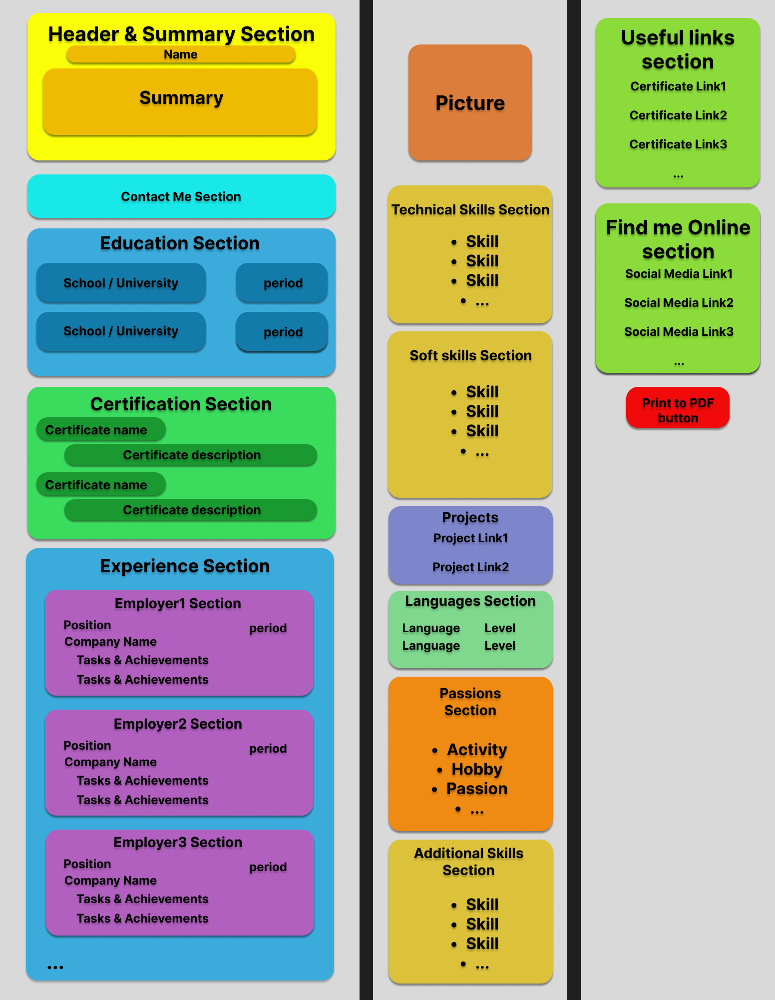
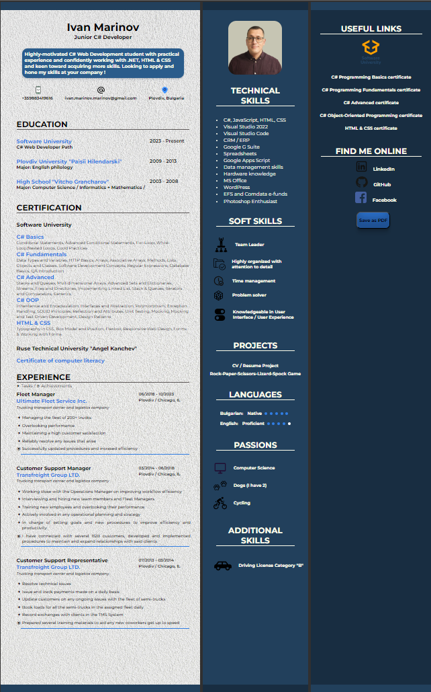

# CV/Resume Template By Ivan Marinov

## Description:

- A CV / Resume template developed with HTML/CSS

## Technology stack:
- HTML
- CSS
- Figma
  

## Design Diagram:

## Features
- Slick clean look, no excessive use of colors and or fonts and styling.
- Customizable pictures / icons / colors / background / fonts.
- Email link in the contact section that lets you click to email quickly.
- Effects and links in the Certification section (hover over the course's name). Every course is a link to the corresponding certificate.
- Certificate links are additionally added in the most right column under USEFUL LINKS as well.
- Hover effect in the PASSIONS section --> Dogs section ( hovering will show a picture of my two pets ).
- Links in the FIND ME ONLINE Section, CERTIFICATION Section and the PROJECTS Section open in a new ( blank ) tab/window.
- Save as PDF button that would let you Print or Print to PDF ( suggested format: A4, no margins, with the background graphics ).

## Screenshots: 

## Planned updates:

- Responsive.css
  

 
